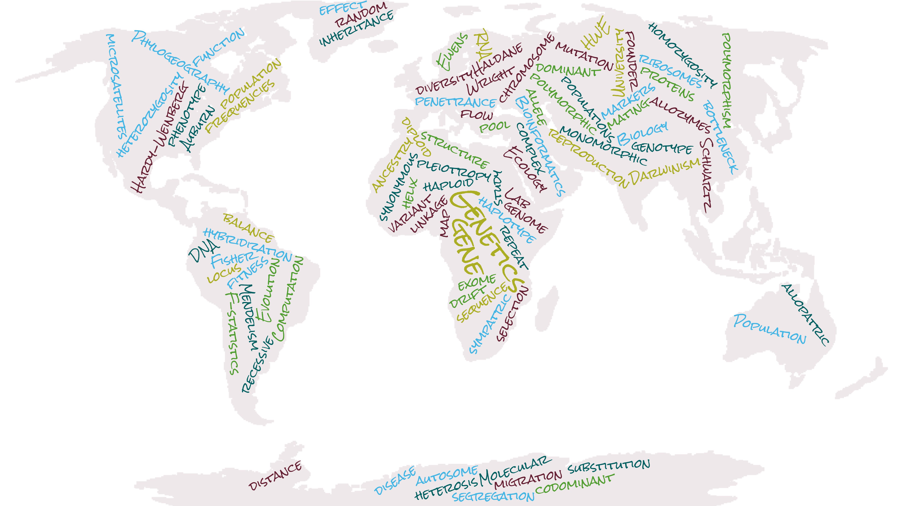

```{r, echo=F}
#keep the code below spaced exactly as it is. If you take out spaces, the image disappears 
 
```
<center>


</center>

```{r, echo=F}

#to change font formatting: 
#<font size="1"> This is my text number1</font> 


```

<font size="3"> 


Place text here explaining the point of the tutorials, how you can follow them, which order we recommend...

</font>

